# Cosmic Whisper

  

_Cosmic Whisper_ is an interactive educational game developed to inspire interest in optics and electrical engineering through immersive and hands-on problem solving. Designed under Professor Saharnaz's supervise at UC San Diego, the game simulates a mission in which players act as scientists attempting to communicate with an alien civilization orbiting a chaotic three-star system, drawing inspiration from _The Three-Body Problem_. Players must solve a series of challenges involving light transmission and absorption, spectroscopy, optical ciphers (Morse code and Vigenère), and intensity modulation. These tasks introduce foundational physics and engineering concepts in a dynamic and exploratory format.
The final stage expands the game’s interactivity through real-time audio and light processing. It includes digital frequency detection using a microphone and FFT on an ESP32 to map sound frequency to LED colors and a digital envelope follower to control LED brightness based on sound amplitude. These elements demonstrate signal processing, circuit design, and optoelectronic feedback in an accessible way.
Cosmic Whisper will be showcased at outreach events to engage K-12 and general audiences, making complex scientific principles more visible and exciting. Through playful experimentation, the project promotes STEM learning and demonstrates the creative intersection of science, engineering, and game design.

## Materials Required
The game is built using a combination of **3D-printed components** and **electronic hardware**, including:
- **Optical Components:** Diffraction grating slide, light source (flashlight/light bulb), glass/plastic containers, laser pointers
- **Electronics & Sensors:** ESP32-CAM, ESP32, LEDs, linear actuator, relay module, IR LED, IR sensor, IR remote, LED strips, number pad, servo motor

## Game Logistics
Players must solve a series of **three interconnected puzzles** to complete their mission:

1. **Spectroscopy Challenge:** Identify the correct substances among a set of samples using a spectrometer and UV light. The correct substances reveal a password and keyword, allowing access to the next stage.
2. **Morse Code Decryption:** Observe the blinking LED sequences and decode the Morse code, decipher the Vigenère cipher to unlock the second password.
3. **Signal Transmission Puzzle:** Align the signal tower (a laser pointer mounted on a servo motor) to the sun using the control panel, setting the correct coordinates. When the LED strips light up, it confirms the signal has been successfully transmitted, completing the game.

## Substances Chart
| Set | Question | Choices | Correct Answer | Reasoning |
|----------|----------|:----------|:----------:|----------|
| **Food Dyes 1** | Which substance is missing wavelengths **Blue & Green** on the spectrum? | ➀ Fruit Green ➁ Sunset Yellow ➂ Lemon Yellow | **➁ Sunset Yellow** | Not obvious due to similar colors.|
| **Food Dyes 2** | Which substance has the **most wavelengths** on the spectrum? | ➃ Sunset Red ➄ Royal Blue ➅ Grape Violet | **➅ Grape Violet** | Unexpected due to its dark color. |
| **Food Dyes 3** | Which substance has the wavelength **Violet** on the spectrum? | ➆ Super Red ➇ Deep Pink ➈ Chocolate Brown | **➇ Deep Pink** | Not expected to be known. |
| **Fluorescent Powder** | Which substance glows **Light Blue** under UV light? | ⓵ Sky Blue ⓶ Blue Green ⓷ Olivine | **⓵ Sky Blue** | Identical under daylight. |

**Substances set up:** For food dyes, 1-1.5 drops each, into 50 mL vials.

## Understanding Spectroscopy and Food Dye Absorption
### How the Spectrometer Works
A spectrometer is an optical instrument that analyzes the composition of light by breaking it down into its **wavelength components**. It works by:
1. Passing light through a sample (in this case, food dye solutions).
2. Using a diffraction grating or prism to separate the light into its spectrum.
3. Detecting the intensity of each wavelength and plotting it as a graph.

When light shines through a **colored liquid**, certain wavelengths are **absorbed** by the substance while others **pass through** or are **transmitted**. The spectrometer captures these patterns, producing a **spectral absorption graph**, like the ones in the images below.

  

  

### Interpreting the Spectral Plots
Each plot shows **intensity vs. wavelength**, revealing which colors of light are absorbed or transmitted:
- Sharp peaks indicate **high transmission** (less absorption) of that wavelength
- Dips or missing wavelengths correspond to **absorption**, meaning the dye absorbs those colors from the light

For example, in the above graphs: 
- The first graph (Set 2) has a strong peak in the **blue/violet region** (~450 nm), suggesting that one of the substances absorbs less blue light and transmits it more
- The second graph (Set 3) has broader peaks in the **red** and **yellow regions** (~600–650 nm), yet only one has a peak at **blue/violet region** (~450 nm), suggesting that only one substance shows obvious **blue/violet** on the spectrum

By analyzing these spectra visually using the spectrometer, players in the game can determine **which substances contain specific wavelengths** and use that information to unlock the puzzle answers.

## Components Designed
### Spectrometer

  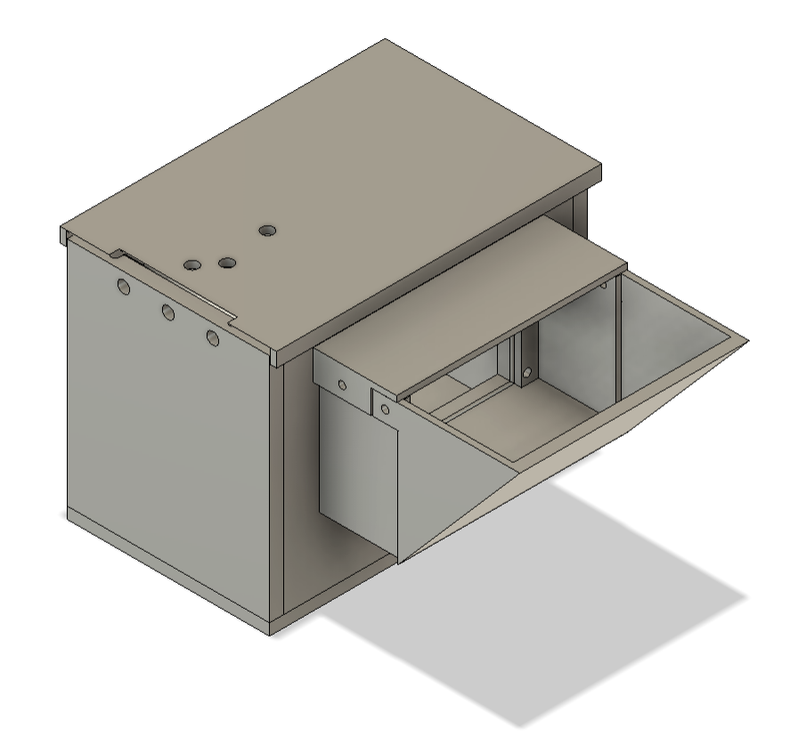
  &nbsp;&nbsp;&nbsp;&nbsp;&nbsp;
  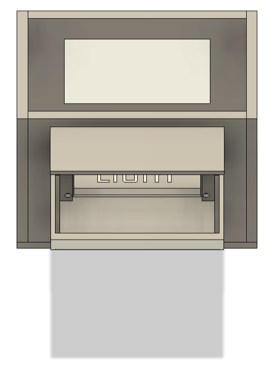

### Samples Holders

  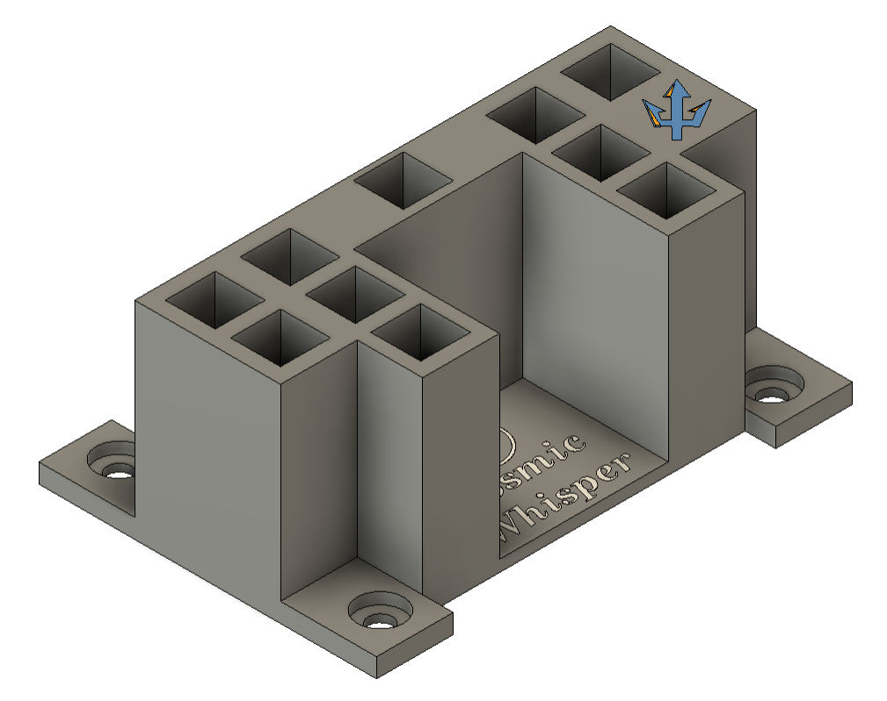

  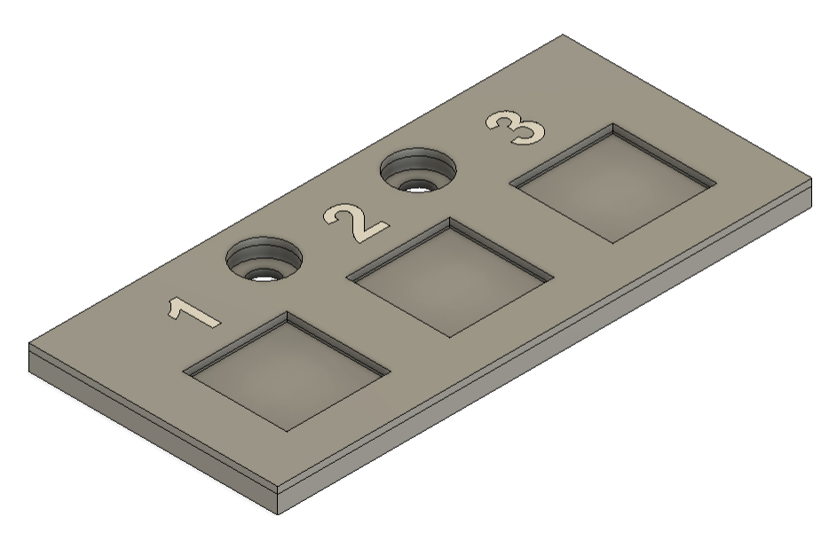
  &nbsp;&nbsp;&nbsp;&nbsp;&nbsp;
  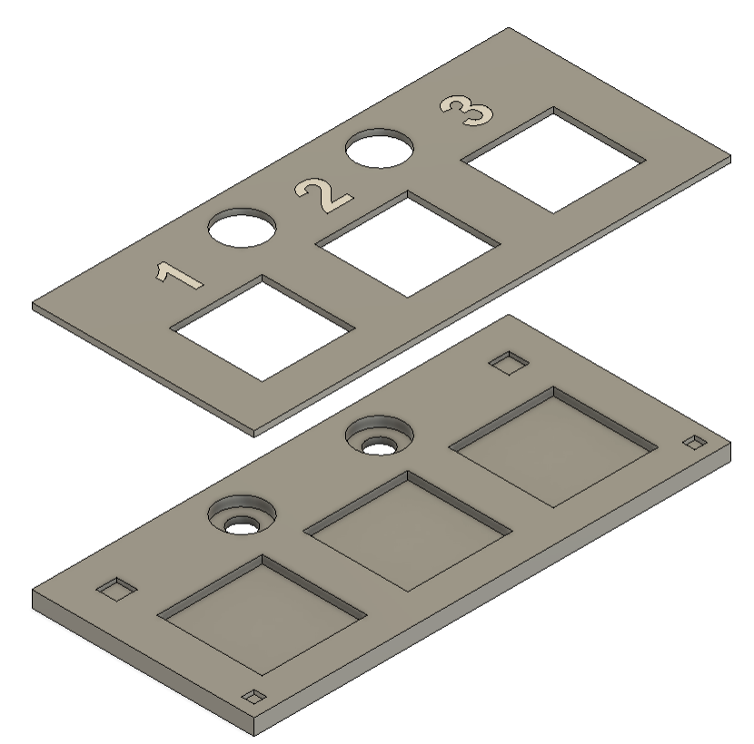

### Linear Actuator Mount

  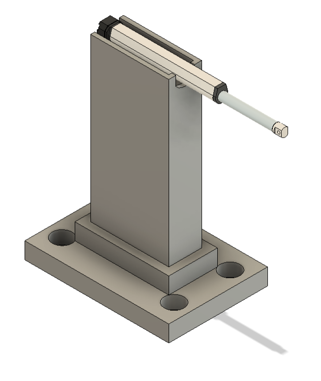

### Center Console

  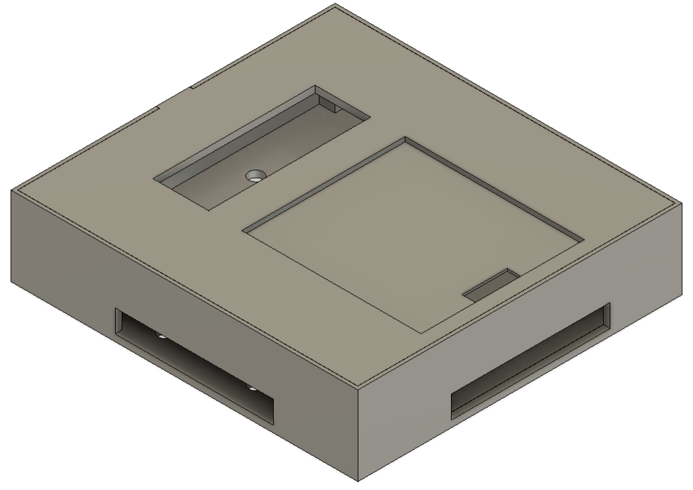
  &nbsp;&nbsp;&nbsp;&nbsp;&nbsp;
  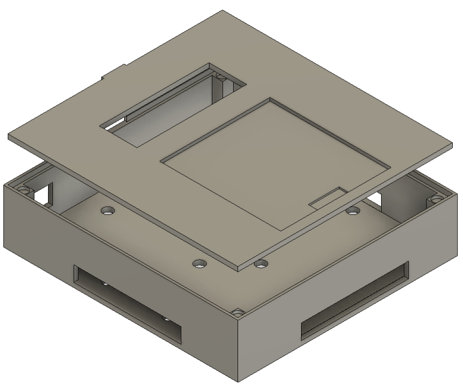

### Morse Code Case

  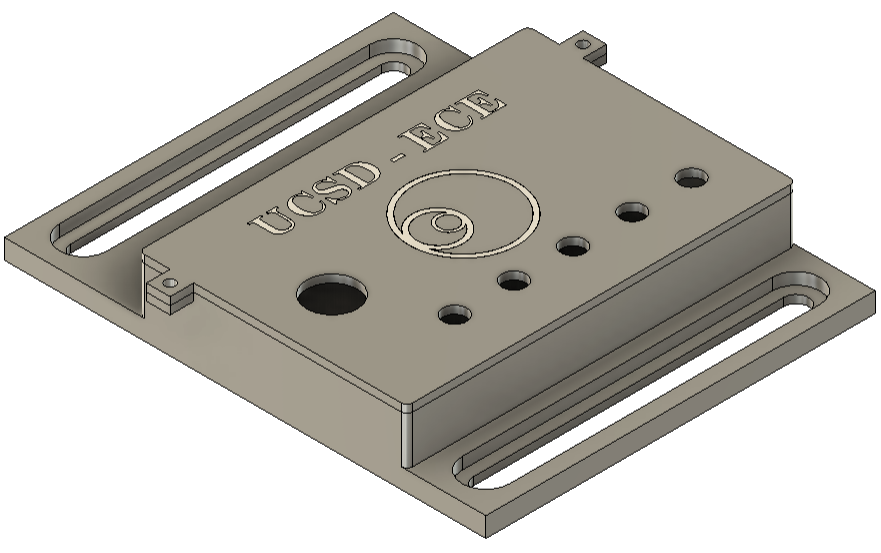

### Sensors Case

  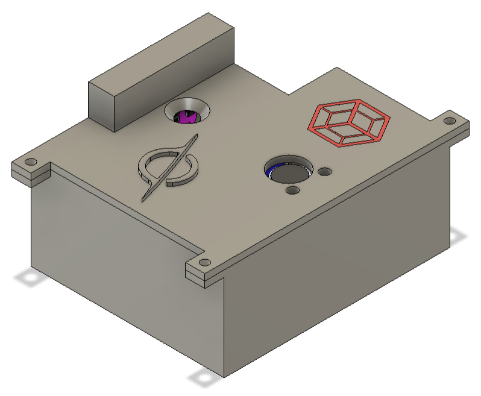
  &nbsp;&nbsp;&nbsp;&nbsp;&nbsp;
  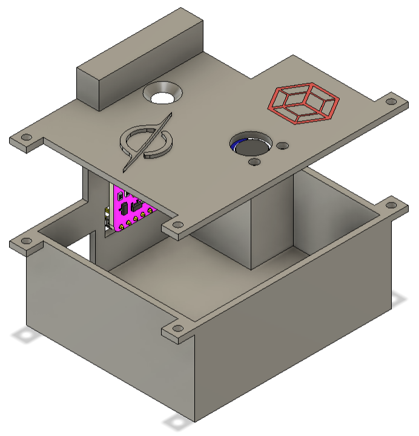

### SAE 304 Stainless Steel Board

  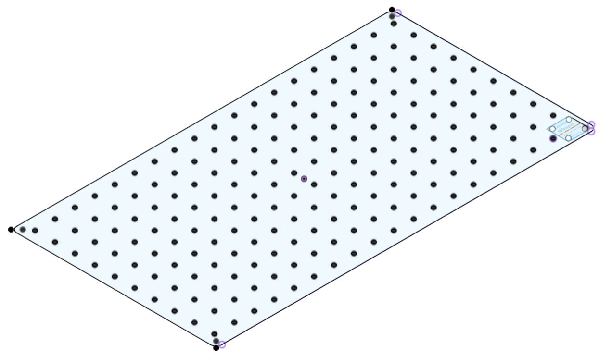

### Board Supports

  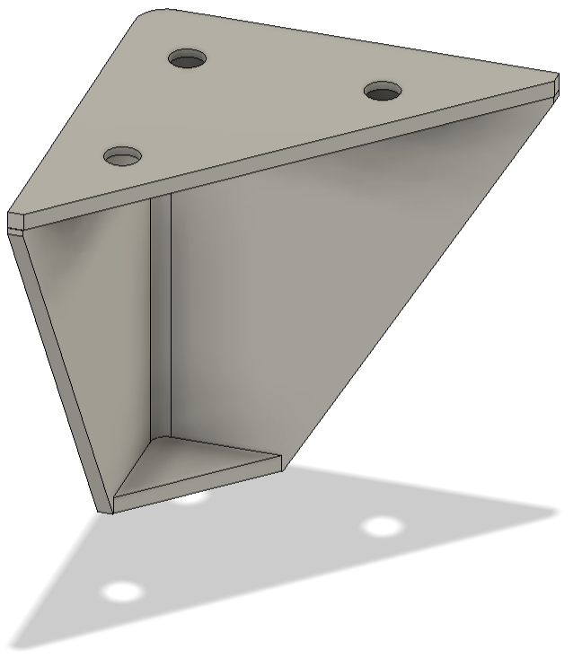
  &nbsp;&nbsp;&nbsp;&nbsp;&nbsp;
  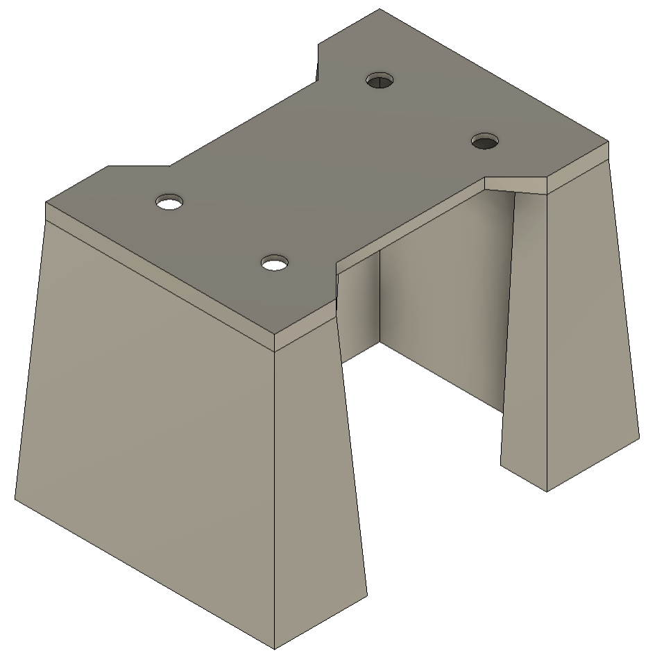

## Technical Info
### ESP32-S3 MCU Programming
Designed and programmed the entire flow of the game in one .cpp file.

### Components and Wire Management
Most components have the ability to be uninstalled easily. Soldered all components using pre-crimped silicone cables to keep everything clean and easy to manage and maintenance. Clean wire management to have a neat place.

### Metal Laser Cutting
Using a fablight FL4500 laser cutter, a SAE 304 stainless steel was cut and engraved from the designed .dxf files.

